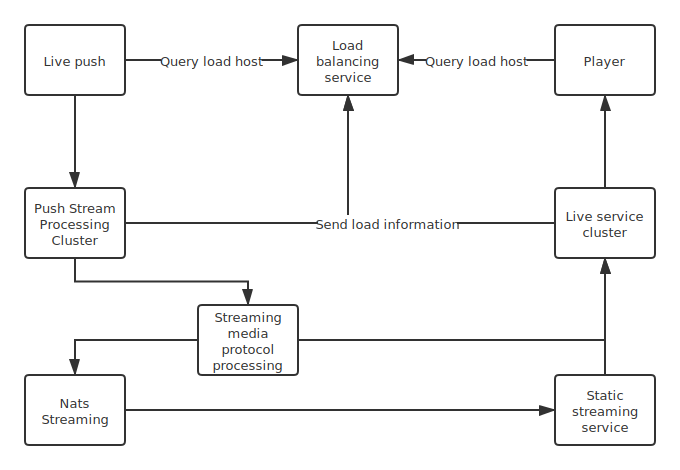

专注于构建大型高可用高性能流媒体集群，主要使用Rust编程语言构建.
这是新的尝试，也是良好的开端.
希望使用Rust的高性能和优雅的设计使其在流媒体领域越走越远.

### 架构设计
> 包含推流处理，媒体协议处理，直播点播服务，并包含为多服务集群提供高可用的负载均衡服务.

### 版本
开发以及立项阶段  

### 源代码管理
* `master` 主分支(稳定分支).
* `nightly` 测试分支(不稳定版本).
* `dev-*` 开发人员分支(开发人员分支).

### 计划
> 早期计划只支持RTMP, HLS, HttpFLV协议. 
> 并且目前只考虑H264编码. 
> 对于WebRTC和VP9的支持在远期计划中. 

* [ ] Rtmp推流处理服务(Rust). 
* [ ] 推流处理服务外壳(Node.Js or Go). 
* [ ] 负载均衡核心服务(Rust). 
* [ ] 负载均衡边缘节点服务(Rust). 
* [ ] 多媒体处理服务(Rust and C). 
* [ ] 播放推流服务(Rust). 
* [ ] 静态流服务(Rust). 

### 概述
* 推流服务处理推流端推送的音视频流. 
* 音视频流通过多媒体处理服务统一处理成标准格式. 
* 将音视频流推送到Nats媒体流队列中. 
* 同时将实时音视频流保准为静态文件供点播服务使用. 
* 直播服务获取Nats媒体流队列中的音视频数据推送给播放端. 

### 展望
* 实现推流端SDK. 
* 实现自开发流媒体协议. 
* 尽可能多的协议支持. 
* 极限的性能表现. 
* 脱离FFmpeg套件. 

### 许可证
[GPL](./LICENSE)
Copyright (c) 2020 Mr.Panda.