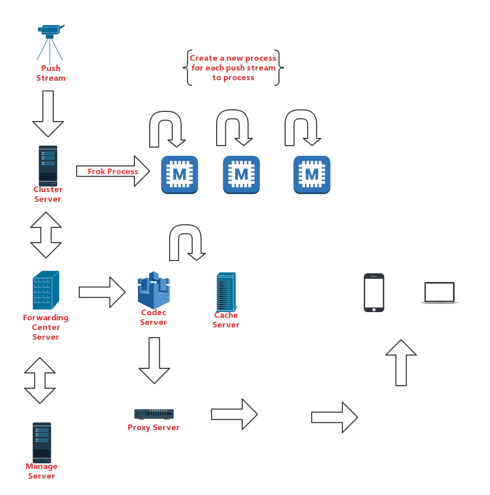

Media streaming server written in Rust. 
Build a high-performance streaming distribution server with Rust's zero abstraction and minimal runtime.





## Version
- No Version


## Supported encoding
- Push [`RTMP`]
- Pull [`WebSocket`]
- codec [`FMP4`]


## Features
- Complete codec.
- Join support for HLS.
- Support for encoding format conversion.


## Use

#### Build.
```bash
./build.sh `out dir`
```


## Configure
> path: ~/project/configure.toml

#### Push
> push stream options

* `host` `{String}` bind address.
* `port` `{Number}` bind port.

#### Server
> pull stream options

* `host` `{String}` bind address.
* `port` `{Number}` bind port.


## License

[MIT](./LICENSE)

Copyright (c) 2019 Quasipaas.