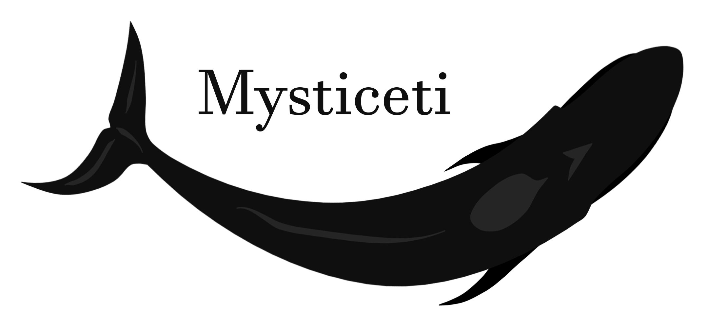

    

 
<h1></h1>

    <strong>WebRTC Server implemented by ❤️ Rust</strong>

    
    
    
    
    

 
 

Mysticeti is a WebRTC server solution implemented using Rust and supports the SFU/MCU model. Compared with other ongoing projects, the current project prioritizes WebRTC one-to-many live broadcasting, but this does not mean that the project will give up peer-to-peer two-way dialogue. Our ultimate goal is commercial level, intercontinental cluster, low latency, high throughput, high performance, high reliability, rich peripheral interfaces.  
The project is currently being developed by myself and is expected to be a long-term plan. This is the challenge I brought to myself.  

### Roadmap

- [x] STUN
- [x] TURN
- [x] RTP
- [ ] SRTP
- [ ] DTLS
- [ ] SDP
- [ ] ICE
- [ ] SFU
- [ ] MCU

### License
[GPL](./LICENSE)
Copyright (c) 2020 Mr.Panda.
