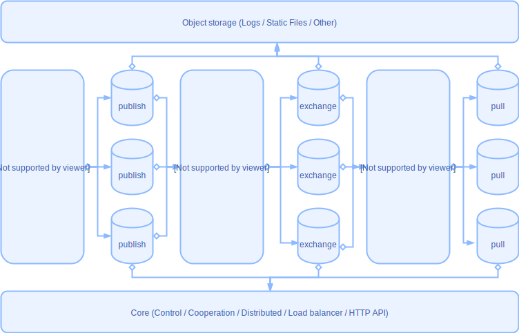

# Quasipaa

这是一个主要使用Rust编程语言构建的实时音视频流服务集群，这是新的尝试和良好的开端.
希望依靠Rust的高性能和优雅的设计在流媒体领域中越走越远.

### 版本
开发阶段  
项目进度更新在 [项目看板](https://github.com/quasipaas/Quasipaa/projects/1)，可以随时跟踪. 

### 设计

### 概述
Quasipaa是使用Rust编程语言编写的流媒体服务集群，其中包括可以水平扩展的多个独立服务:
* 流推送服务，用于处理实时流推送. 
* 媒体数据交换中心处理混合来源. 
* 控制中心，为多个水平服务提供负载平衡和群集管理. 
* 静态文件和直播回放服务. 
* 多协议直播流推送处理服务. 

### 计划
> 早期计划仅支持RTMP，WebRTC，HttpFLV协议. 

* [x] rtmp推送流处理 
* [x] 流交换中心 
* [x] 负载均衡服务 
* [ ] 音视频数据处理 
* [x] 直播服务 
* [ ] 直播回放和静态文件支持 
* [ ] WebRTC TURN支持 

### 展望
* 推流SDK. 
* 自主开发的流协议. 
* 支持尽可能多的现有协议. 
* 尽可能好的表现. 
* 自适应多重编码. 

### License
[GPL](./LICENSE)
Copyright (c) 2020 Mr.Panda.
