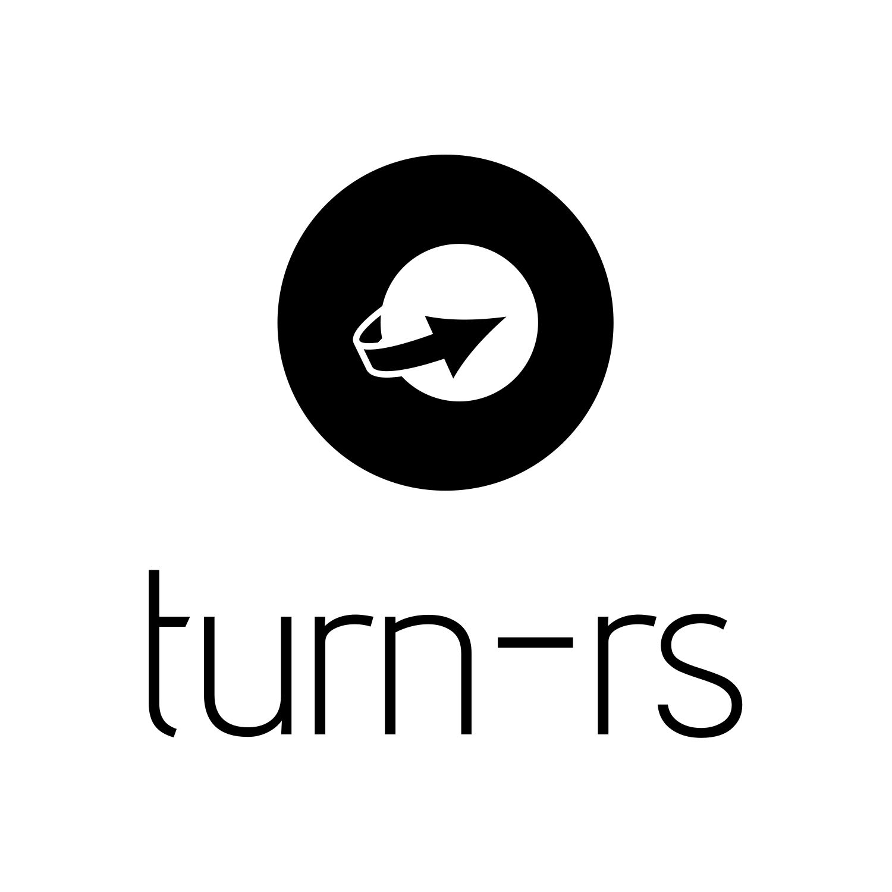

<!--lint disable no-literal-urls-->
<div align="center">
  
</div>
<br/>
<div align="center">
  <strong>WebRTC Server implemented by ❤️ Rust</strong>
</div>
<div align="center">
  
  
  
  
  
</div>
<br/>
<br/>

Mysticeti is a WebRTC server solution implemented using Rust and supports the SFU/MCU model. Compared with other ongoing projects, the current project prioritizes WebRTC one-to-many live broadcasting, but this does not mean that the project will give up peer-to-peer two-way dialogue.

## Table of contents

* [Roadmap](#roadmap)
* [Building](#building)
  * [Prerequisites](#prerequisites)
  * [Build workspace](#build-workspace)
  * [Turn Server](#turn-server)
* [Code style](#code-style)

## Roadmap

- [x] TURN **not production-ready**.
  - [x] STUN
- [ ] WebRTC
  - [x] RTP
  - [ ] SRTP
  - [ ] DTLS
  - [ ] SDP
  - [ ] ICE
- [ ] SFU
- [ ] MCU

## Building

### Prerequisites

You need to install the Rust toolchain, if you have already installed it, you can skip it, [Install Rust](https://www.rust-lang.org/tools/install), then get the source code:

```bash
git clone https://github.com/Mycrl/Mysticeti
```

And, you need to install the openssl toolchain.

#### Windows

If you have [chocolatey](https://chocolatey.org/install) installed you can install openssl via a single command i.e.

```bash
choco install openssl
```

#### Linux

```bash
sudo apt-get install libssl-dev
```

#### Macos

```bash
brew install openssl
```

### Build workspace

Compile the entire workspace in release mode:

```bash
cd Mysticeti
cargo build --release
```

After the compilation is complete, you can find the binary file in the "target/release" directory.

### Turn server

If you only need to compile the turn server separately:

```bash
cd Mysticeti/turn
cargo build --release
```

## Code style

The coding style of this project may not conform to the community style or the habits of most people, but it conforms to my own style. I have paranoid requirements for the code format, I know this is a bad habit, and the current project is also independently developed and maintained by me. If you have more suggestions, you can tell me.

## License
[GPL](./LICENSE)
Copyright (c) 2020 Mr.Panda.