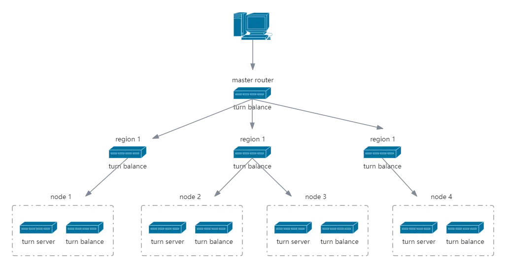

<!--lint disable no-literal-urls-->
<div align="center">
  <h1>turn-balance</h1>
</div>
<br/>
<div align="center">
  <strong></strong>
</div>
<div align="center">
  
  
  
  
</div>
<div align="center">
  <sup>A simple distributed load balancing service.</sup>
</div>
</br>
</br>

This is a simple distributed load balancing suite that contains both clients and servers and supports unlimited cascading.


## Toppology



> Note that the communication protocol between balances uses udp and does not retransmit, if a packet is lost the current node will never enter the candidate again.

#### Server

You can deploy a Balance server in each region and in the server room where the turn server is located and support unlimited cascading, but require each Balance server to be externally accessible.

#### Client

The client provides SDKs and libraries that can be embedded into your own applications. You can specify a top-level node on the client and initiate a speed query.  
The client will first ask the top server, the top server will reply to the client with all the subordinates of the current server, the client will concurrently launch a query after getting the list of subordinates, and the first server that replies will become the top server again, and so on iteratively until the node where the turn server is located is found.


## Usage

> The version on crates.io can be very outdated. It is recommended to compile directly from the github source or download the compiled binary from the [release](https://github.com/mycrl/turn-rs/releases).

Start with configuration file:

```bash
turn-balance --config=/etc/turn-server/balance.toml
```

Please check the example configuration file for details: [turn-balance.toml](./turn-balance.toml)

#### Client example

```rust
use turn_balance_client::Balance;
use std::net::SocketAddr;

#[tokio::main]
async fn main() {
    let server = "127.0.0.1:3001".parse::<SocketAddr>().unwrap();
    let balance = Balance::new(server).await.unwrap();
    
    if let Ok(node) = balance.probe(10).await {
        // node is a socket addr.
    }
}
```


### License
[GPL](../LICENSE) Copyright (c) 2022 Mr.Panda.
