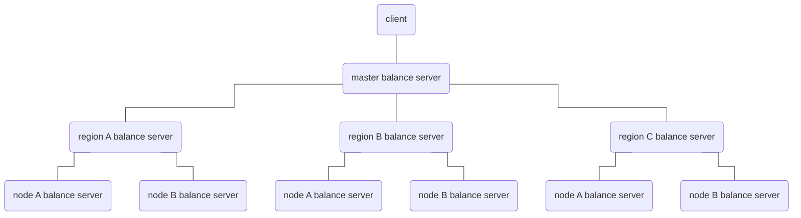
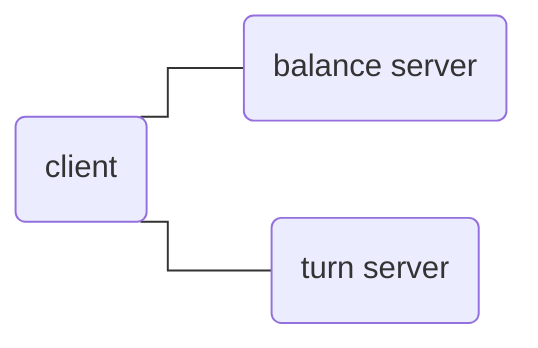
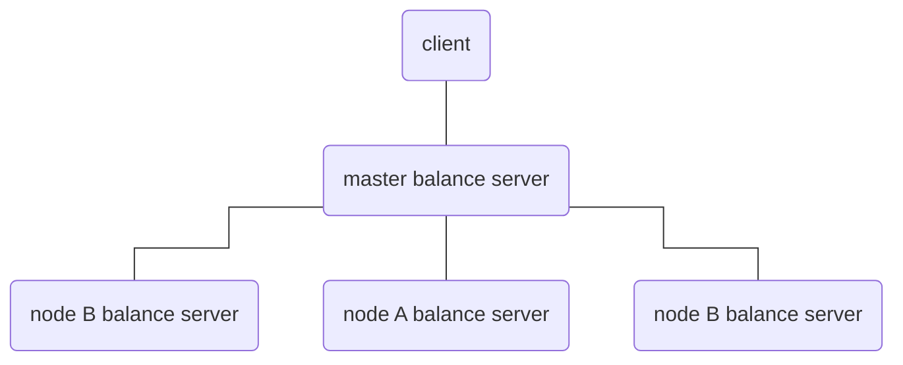

<!--lint disable no-literal-urls-->
<div align="center">
  <h1>turn-balance</h1>
</div>
<br/>
<div align="center">
  <strong></strong>
</div>
<div align="center">
  
  
  
  
</div>
<div align="center">
  <sup>A simple distributed load balancing service.</sup>
</div>
</br>
</br>

This is a simple distributed load balancing suite that contains both clients and servers and supports unlimited cascading.


## Toppology



> Note that the communication protocol between balances uses udp and does not retransmit, if a packet is lost the current node will never enter the candidate again.

#### Server

You can deploy a Balance server in each region and in the server room where the turn server is located and support unlimited cascading, but require each Balance server to be externally accessible.

#### Client

The client provides SDKs and libraries that can be embedded into your own applications. You can specify a top-level node on the client and initiate a speed query.  
The client will first ask the top server, the top server will reply to the client with all the subordinates of the current server, the client will concurrently launch a query after getting the list of subordinates, and the first server that replies will become the top server again, and so on iteratively until the node where the turn server is located is found.


## Usage

> The version on crates.io can be very outdated. It is recommended to compile directly from the github source or download the compiled binary from the [release](https://github.com/mycrl/turn-rs/releases).

Start with configuration file:

```bash
turn-balance-server --config=/etc/turn-server/balance.toml
```

Please check the example configuration file for details: [turn-balance.toml](./turn-balance.toml)

#### Single instance



This is not recommended because single instance does not need load balancing at all, but you can use it if you just want to test the speed and condition of the network connection between the client and the turn server. In the case of single instance deployment, the balance server will directly return the socket addr of the turn server.  

In the single-instance case, you don't need to configure anything else, you just need to specify the listening address and the turn server's listening address. Usually these two services are deployed to the same server, but it's not really an absolute, you are free to deploy them depending on where the network you want to speed test is located.  

If both turn balance and turn server are deployed to the same machine, and the turn server's listening address is `127.0.0.1:3478`, then configure how the client can specify the balance server address to be `127.0.0.1:3001`.

```toml
[net]
bind = "127.0.0.1:3001"
[turn]
bind = "127.0.0.1:3478"
```

#### Distributed deployment



The sample configuration is as follows, the main balance server listens on `192.168.1.1:3001`, the other three nodes are `192.168.1.2`,`192.168.1.3`,`192.168.1.4`.

##### master balance server

```toml
[net]
bind = "192.168.1.1:3001"

[cluster]
nodes = [
  "192.168.1.2:3001",
  "192.168.1.3:3001",
  "192.168.1.4:3001"
]
```

##### node

```toml
[net]
# Same for other nodes.
bind = "192.168.1.2:3001"

[cluster]
superiors = "192.168.1.1:3001"

[turn]
# Same for other nodes.
bind = "192.168.1.2:3478"
```

If you have multiple turn servers, then you can use a distributed deployment scheme, where each node where the turn server is located deploys a turn balance server and externally deploys a master balance server, which is requested by the client, so that the nearest node to the user will be automatically filtered.  


## License

[GPL](../LICENSE) Copyright (c) 2022 Mr.Panda.
